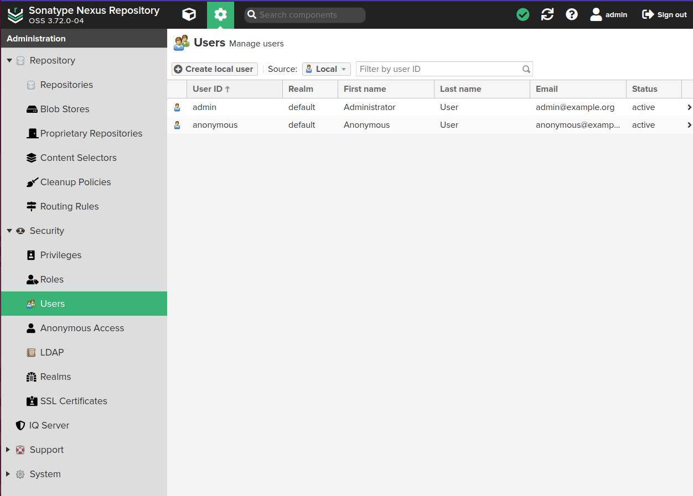
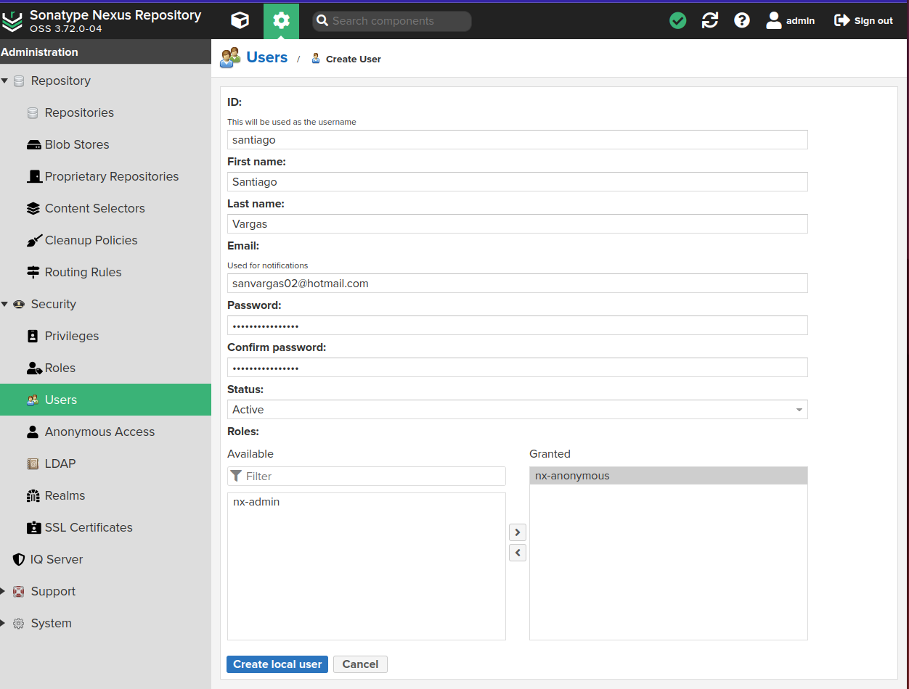
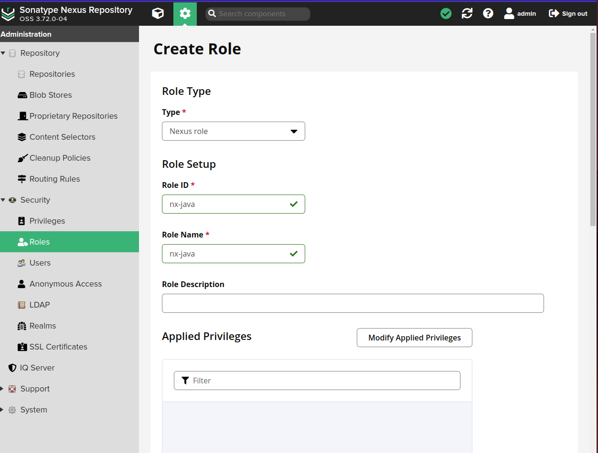
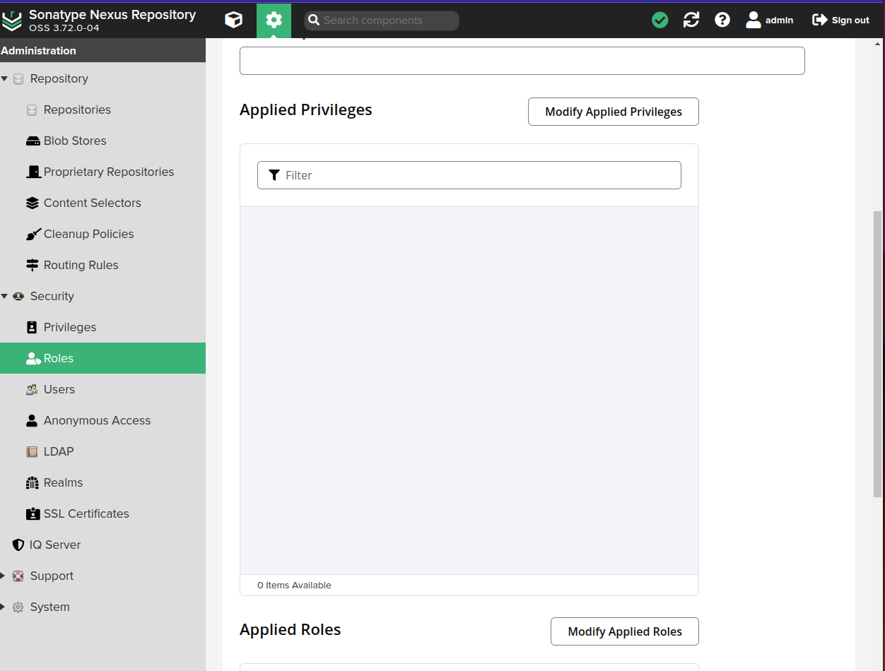
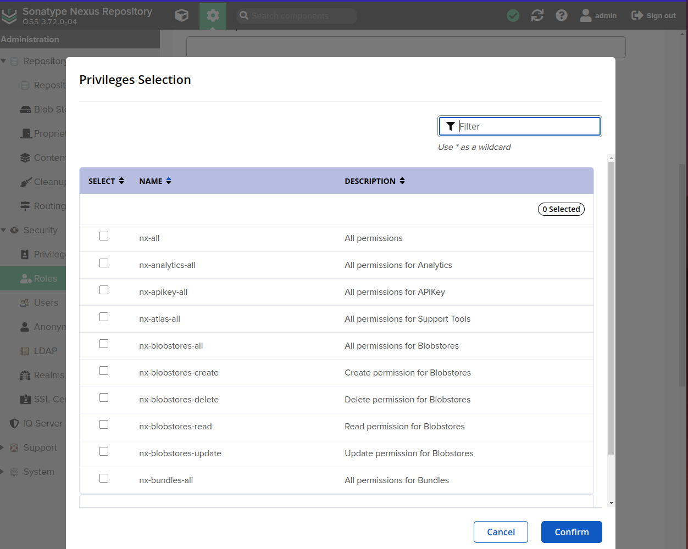
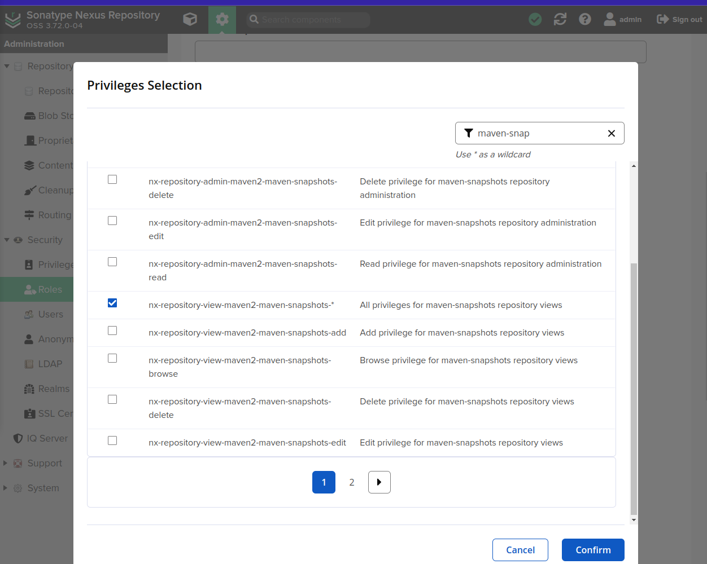
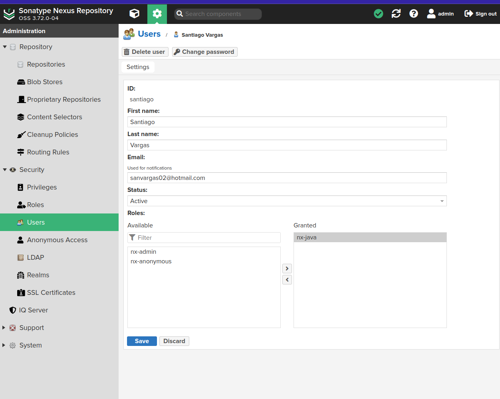

# Publish Artifact to Nexus Repository (Project)

## Introduction
In this project, we will focus on uploading a Jar file to an existing hosted repository in Nexus using Maven or Gradle. 

### Key Steps:
- **Upload Jar File**: Push the file to the hosted repository in Nexus.
- **Maven/Gradle Command**: Use the appropriate command for pushing to the remote repository.
- **Configuration**: Set up both tools (Maven or Gradle) to connect to Nexus using the Nexus Repository URL and Credentials.
- **Permissions**: Ensure that the Nexus user has the permission to upload artifacts.

## Create Nexus User and Assign Permissions

To upload artifacts, we need to create a Nexus user and assign the necessary permissions. **Note**: Typically, users are not created manually; they are integrated from the company with LDAP. However, for this example, we will create a user manually.

### Steps:
1. Navigate to **Settings** > **Security** > **Users**.
   
2. Click on **Create local user**.
   
3. Now we need to create a role for the user:
   - Go to **Security** > **Roles**.
   - Click on **Create Role**.
   

### Assign Permissions:
We have a list of permissions that we can assign to the role. Common permissions include: 
- **Add**
- **Browse**
- **Delete**
- **Edit**
- **Read**
 
  

### Role Categories:
There are two main categories of roles:
- **Administrators**: These roles are usually for Nexus admins (DevOps), who manage tasks like backups, installing plugins, and general Nexus maintenance.
- **Developers**: These roles are for users who need to upload or fetch artifacts from Nexus.

In our case, we want the role to have permissions to:
- Upload the jar file.
- Retrieve information about the jar file.

### Assigning the Role:
- Select the **Views** option.
   
- Apply the **Role Selections** if you want to.
- Save the role.

### Assigning the Role to the User:
1. Assign the role to the user you created.
    
2. Now, you can use this **user** in your project to provide the **Gradle** or **Maven credentials** to connect to Nexus. (Maven/Gradle → User → Nexus).

#### UNTIL HERE I HAVE THE FIRST PART - INTRO AND CREATION OF USER

## Gradle Project Configuration with Nexus

To set up a Gradle project for publishing artifacts to Nexus, follow these steps:

### Steps:
1. **Clone the Gradle Project** and open it in your IDE.
   - If a build has already been done, it might need to be deleted to apply the necessary configurations.

2. **Add the Maven Publishing Plugin**:
   - We are going to add a plugin to publish a Jar file to a Maven repository format (since Maven and Gradle use the same format to upload Java artifacts).
   - This allows Gradle to connect to Nexus and push to its Maven repository.
   - Refresh/reload the Gradle project after adding the plugin.

3. **Configure the Publishing Block**:
   - In this block, we configure the Jar file publications to be uploaded, and set the Nexus repository where the Jar will be uploaded.

4. **Set the Publications Block**:
   - In this block, add the path to the Jar file from the build directory.
   - Define the version in the same block.

5. **Configure the Repositories Block**:
   - Add the Nexus information, including the repository name, URL, credentials, etc.
   - Each repository has its own URL, which can be seen in Nexus.

6. **Upload to Maven Snapshots**:
   - For development, we are going to upload to the `maven-snapshots` repository.
   - If we need to release a stable version, we will upload it to `maven-releases`.
   - **Note**: Snapshots are for development and testing, while releases are for production.

7. **Set the Credentials Block**:
   - Add the Nexus username and password. 
   - **Important**: Do not hardcode credentials directly in the code to avoid tracking sensitive information in Git/GitHub. Instead, create a Gradle properties file.

8. **Update the `settings.gradle` file**:
   - Change the name of the app if necessary.

9. **Allow Insecure Protocol**:
   - Since we are not using HTTPS (SSL encryption) to connect to Nexus yet, allow the insecure protocol in the configuration.

10. **Reload Gradle**:
    - Reload or apply Gradle changes to ensure all configurations are updated.
    
---

## Gradle Project Jar Upload

### Steps:
1. **Build the Project**:
   - Run `gradle build` to create the Jar file.

2. **Prepare for Upload**:
   - With the Jar ready, search the build directory to confirm that it exist in the terminal.
   - Use the `gradle publish` command to upload the Jar. This command was enabled by the plugin added to the `build.gradle` file (it is not a default Gradle command).

3. **Verify in Nexus**:
   - Go to the **Browse** option in Nexus to see the different components in your repository.
   - Check the `maven-snapshots` repository to see your app. The package name (e.g., `my-app`) will appear, and other folders represent the configuration group.
   - Expand the package to view the Jar file and other metadata files.
   - 
#### UNTIL HERE I HAVE THE SECOND PART - GRADLE PROJECT CONFIG AND UPLOAD

## Maven Project Configuration with Nexus and Jar Upload

To configure a Maven project to upload a Jar file to Nexus, follow these steps:

### Steps:
1. **Configure the `pom.xml` File**:
   - The file where we are going to configure the upload is the `pom.xml`.

2. **Add the Plugin**:
   - First, configure the plugin that enables the upload of the Jar file to Nexus. 
   - In the first block, specify the version of the plugin and the plugin itself.

3. **Reload Maven**:
   - After configuring the plugin, reload Maven to apply the changes.

4. **Configure the Nexus Repository**:
   - Set the location of the Nexus repository. The repository can have any `id`, but this `id` will help identify it between other repositories.

5. **Reload Maven for Snapshots**:
   - Reload Maven again to configure for snapshots.

6. **Configure User Credentials**:
   - The user credentials must be configured in a specific directory. 
   - This directory is located inside `.m2`, where Maven stores its dependencies.
   - Inside `.m2`, create a directory for global Maven credentials (accessible for all Maven projects).

7. **Create `settings.xml`**:
   - Use the command `vim settings.xml` to create the file.
   - Set the credentials for the Nexus user and define the same repository `id` that you used in `pom.xml`.

8. **Upload the Jar to Nexus**:
   - All is set to upload the Jar file to Nexus.
   - First, build the Jar file.
   - Navigate to the project and run the Maven command to build it (`mvn build`).
   - The target folder will contain the Jar file.

9. **Upload the Jar**:
   - Use the `mvn deploy` command to upload the Jar to Nexus.
   - You can now see the project Jar in the Browse section under `maven-snapshots`.

